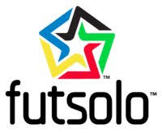

 # Futsolo Project 

**Purpose** – Develop a sales strategy by creating a database of Soccer Clubs and Tournaments from data scraped from the United States Youth Soccer Association website. Identify potential prospects and venues for sale of Futsolo™ Soccer product. 

**Steps**
  *	Scrape data from the website using Pandas and Jupyter Notebook, create tournament and club dataframes, and convert them to CSV.
  *	Reorganize data in CSV files removing duplicates and creating additional columns for further analysis.
  *	Integrated CSV files into Tableau for analysis, visualizations, and mapping.

**Results**
  *	Identified 294 United States Youth Soccer Tournaments and obtained relevant information for each (i.e. name, location, url, competition   type, number of teams, contacts, emails, phone numbers)
  *	Identified 2,507 Soccer Clubs throughout the country and obtained relevant information for each (i.e name, address, url, program type,   contacts, emails, phone numbers)

**Next Steps**
 *	Convert to SQL
 *	Integrate with Pipedrive CRM to develop pipeline and track results.
 *	Integrate with MailChimp for targeted email campaign.

**Tools Used**
 *	Python
 *	Pandas
 *	Splinter/Requests
 *	Urllib
 *	BeaqutifulSoup
 *	Chromedriver
 *	Tableau
 *	CSV
